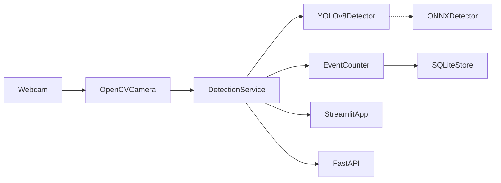

# 🐱 Whiskerscope

Real-time cat detector using your webcam. Powered by YOLOv8 + OpenCV.


## Features

- **Live Detection** — Webcam cat detection with bounding boxes and confidence scores
- **Real-time Dashboard** — Streamlit UI with FPS counter, detection timeline, session history
- **REST API** — FastAPI with Swagger docs, health checks, file validation
- **WebSocket Stream** — Real-time detection events for custom clients
- **Clip Recording** — Automatically saves video clips when cats are detected
- **Persistence** — SQLite-backed detection history that survives restarts
- **ONNX Support** — Optional ONNX Runtime backend for faster inference
- **Dark Theme** — Easy on the eyes for long monitoring sessions

## Quick Start

```bash
# Install
pip install -e ".[dev]"

# Streamlit dashboard (webcam + live UI)
python -m streamlit run src/whiskerscope/adapters/streamlit_app.py

# REST API
uvicorn whiskerscope.adapters.fastapi_app:app --reload

# Run tests
pytest
```

## Docker

```bash
# API + Streamlit
docker compose up

# API only
docker build -t whiskerscope . && docker run -p 8000:8000 whiskerscope
```

## API

Interactive docs at `http://localhost:8000/docs`

```bash
# Detect cats in an image
curl -X POST http://localhost:8000/v1/detect -F "file=@cat.jpg"

# Health check
curl http://localhost:8000/health

# Session stats
curl http://localhost:8000/v1/stats
```

## Configuration

All settings via environment variables (see [.env.example](.env.example)):

| Variable | Default | Description |
|----------|---------|-------------|
| `WS_MODEL_NAME` | `yolov8n.pt` | YOLOv8 model (nano/small/medium) |
| `WS_CONFIDENCE` | `0.5` | Detection confidence threshold |
| `WS_DETECTOR_BACKEND` | `yolo` | Backend: `yolo` or `onnx` |
| `WS_CAMERA_INDEX` | `0` | Webcam device index |
| `WS_DB_PATH` | `whiskerscope.db` | SQLite database path |

## Architecture

Clean Architecture with three layers:

```
domain/       Pure Python models and port interfaces (zero external deps)
application/  Use cases: detection service, clip recorder, event counter
adapters/     YOLOv8, ONNX, OpenCV, Streamlit, FastAPI, SQLite
```



## Stack

Python 3.11+ | YOLOv8 | OpenCV | Streamlit | FastAPI | SQLite | ONNX Runtime (optional)
